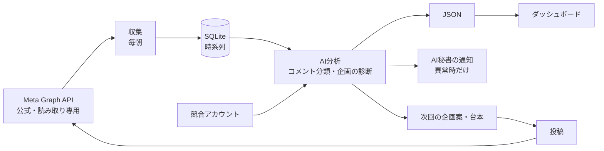

# SNS Growth Cockpit

Instagram 運用の「投稿 → 計測 → 分析 → 次の企画 → 改善」を1つの画面で回すための、AI時代のSNSマーケティング・ダッシュボードです。

目指しているのは、**AI が SNS 運用の参謀になる状態**です。数字を眺めるだけで終わらせず、「次に何を投稿すべきか」「どのコメントに今すぐ対応すべきか」まで、AI が秘書のように教えてくれる状態をつくります。

- **デモ**: https://sns-growth-cockpit.pages.dev/（架空のアカウント「サンプル焙煎所」のデータで動きます）
- **状態**: 1アカウント用のテンプレート（画面＋架空データ生成）を公開中。収集・AI分析のパイプラインは順次公開していきます（[ロードマップ](#ロードマップ)）

> このリポジトリのデータはすべて架空です。実在のアカウント・顧客の情報は含みません。

---

## なぜ作るのか

SNS運用の現場には、次の課題があります。

1. **投稿しても新規の人に届かない。** フォロワーの外に広がらず、インプレッションが伸びない
2. **数字はあるのに、次の打ち手に繋がらない。** Instagram のインサイトは「結果」を見せるだけで、「なぜ伸びたか」「次に何を作るか」は人が毎回考え直している
3. **SNSの数字が、事業の目的と切れている。** 再生数が増えても、売上・問い合わせ・LINE登録に効いているのかが分からない
4. **見落としが事故になる。** ブランドを傷つけるコメントや、効能をうたう表現への指摘を、気づかないまま放置してしまう

このツールは、これらを「計測 → 分析 → 企画 → 改善」のループとして1画面にまとめ、AI に回させることで解決します。

## 今できること

| 画面 | 内容 |
| --- | --- |
| ダッシュボード | フォロワー・投稿本数・再生数・拡散率（中央値）の4指標、期間の切り替えと期間比較、昨日動いた投稿、投稿別パフォーマンス、上位投稿 |
| 分析 | ①企画の評価（どのフックの型が伸びたか → なぜか → 次に何を打つか）②コメントのリスク管理 ③公式インサイト（リーチ・保存・シェア・視聴時間）とフォロワー推移・属性 ④ストーリーの効果 ⑤事業の目的（例：オンラインストアへの送客）との紐付け |
| 週次インサイト | 1週間の数字を事業の目的に照らして読み、要因の仮説・リスク・来週の打ち手（次回企画）を出すレポート |
| 要対応コメント | AIが分類したコメント（質問・クレーム・アンチ・法的リスク等）のうち、対応が必要なものを理由つきで一覧化 |

### 実際の運用から生まれたツールです

作者は SNS 運用代行の会社を経営しています。このリポジトリは、社内で複数の Instagram アカウントを毎朝自動で計測している社内ダッシュボード（Meta Graph API による収集、LLM によるコメント分類、週次レポートの自動生成）から、**顧客の情報をすべて取り除き、誰でも使える1アカウント用のテンプレートとして作り直したもの**です。

画面の作りには、運用の中で受けたフィードバックが反映されています。

- 代表値は **平均ではなく中央値**（1本のバズに引きずられないため）
- 「要対応」は必ず **判定の理由を言葉で出す**（「拡散率 0.06× < 基準 0.10×」など）
- 異常がないときは何も言わない（毎日の成功通知は読まれなくなるため）
- 期間比較では、何と何を比べているかを常に実際の日付で表示する

## 指標の定義

| 指標 | 定義 |
| --- | --- |
| 拡散率 | 再生数 ÷ フォロワー数。1.0× を超えると「フォロワー以上の人に届いた」 |
| 反応率 | （いいね ＋ コメント）÷ 再生数 |
| 拡散率の判定 | 0.10× 未満＝要対応、0.30× 未満＝注意、それ以上＝標準 |
| 平均視聴時間 | Meta の `ig_reels_avg_watch_time`（ミリ秒）を秒に換算 |

180秒を超える動画はライブ・長尺として、拡散率の判定から外します。

## クイックスタート

```bash
cd web
npm install
npm run dev        # 初回は架空のデモデータを自動生成 → http://localhost:5275/
```

| コマンド | 内容 |
| --- | --- |
| `npm run demo-data` | 架空データを作り直す（`web/public/data/` に出力。固定シードなので毎回同じ内容） |
| `npm run build` | 静的サイトとして `web/dist/` に出力（Cloudflare Pages などにそのまま置ける） |

画面は `web/public/data/` の JSON を読むだけの静的 SPA です。自分のアカウントで使う場合は、同じ形の JSON を出力すれば動きます（形は [`web/src/lib/types.ts`](web/src/lib/types.ts) が正です）。

| ファイル | 内容 |
| --- | --- |
| `summary.json` | アカウントの概要（複数アカウントを入れられる形。画面は先頭の1件を表示） |
| `account-<handle>.json` | 投稿・コメント・日次推移・インサイト・診断 |
| `risk.json` | 対応が必要なコメント（直近7日） |
| `weekly/index.json`, `weekly/<週末日>.json` | 週次インサイト |

## 仕組み（目指す全体像）



- データは **Meta の公式 API のみ**で取ります（スクレイピングしない）。権限は読み取り専用で、投稿・返信・DM・広告の操作はできない設計です
- AI の処理は差し替えられる形にします（Claude / Codex などのコーディングエージェントや API）

## ロードマップ

| 段階 | 内容 | 状態 |
| --- | --- | --- |
| 0 | 1アカウント用の画面テンプレートと架空データ生成 | ✅ 公開済み |
| 1 | 収集パイプラインの汎用化（Meta Graph API → SQLite → JSON）。自分のアカウントで毎日回す | 次に着手 |
| 2 | **AI秘書の通知**：「このコメントはブランドにマイナスなので確認を」「新しい競合が伸びている」など、要対応のときだけ知らせる | |
| 3 | **競合・3C分析**：競合アカウントの企画とフックの型を横並びにし、自社の勝ち筋を出す | |
| 4 | **次回の企画案と台本の生成**：伸びた型 × 事業の目的から、次に撮る企画と台本を提案する | |
| 5 | **自律改善ループ**：仮説 → 投稿 → 計測 → 評価 → 次の企画、を KPI（事業の目的）に紐づけて回し続ける | |
| 6 | 複数アカウントとプロジェクト管理：企画・撮影・編集・投稿の進捗を同じ画面で一元管理する | |

## 開発

```bash
cd web
npx tsc --noEmit   # 型チェック
npm run build
```

- React 19 + Vite + Recharts、静的 SPA（`HashRouter`）
- Claude Code / Codex による Vibe Coding で開発しています

## ライセンス

[MIT](LICENSE)
